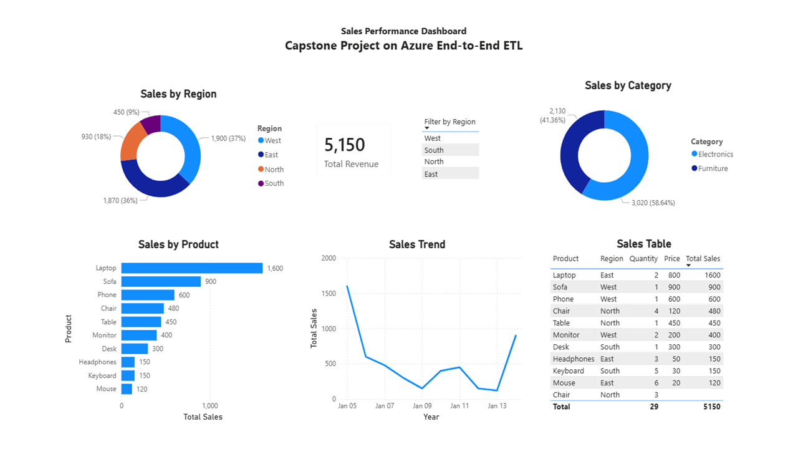
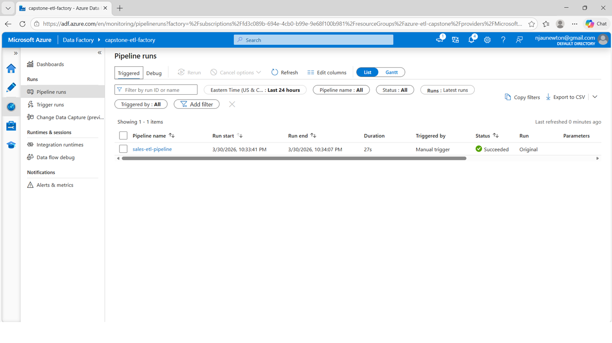
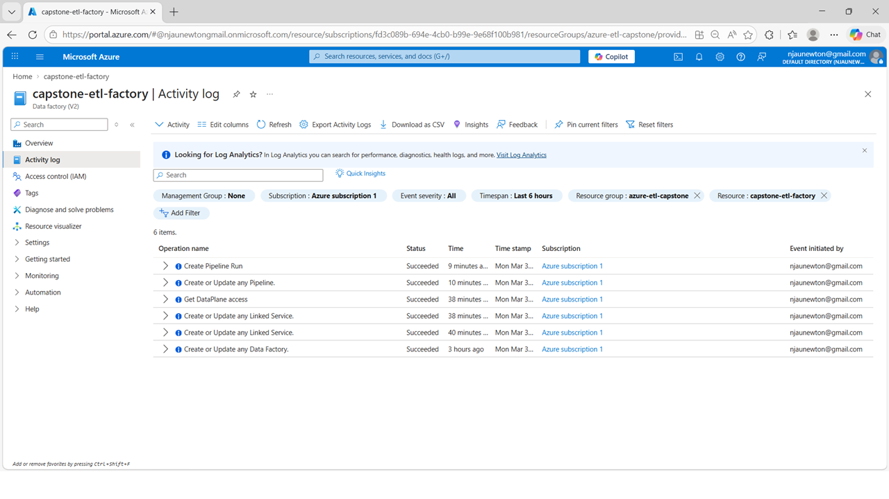

# Azure End-to-End ETL Capstone Project

## Overview

This project demonstrates the design and implementation of a simple end-to-end ETL (Extract, Transform, Load) pipeline using Microsoft Azure cloud services.

The pipeline extracts a raw retail sales dataset, processes it using Azure Data Factory, stores the cleaned data in Azure Blob Storage, and visualizes the results using Power BI Desktop.

This project illustrates how cloud-based tools can be integrated to create a scalable and automated data workflow.

---

## Project Repository

The full project repository containing datasets, pipeline screenshots, the Power BI dashboard, and documentation is available on GitHub:

https://github.com/njaunewton/azure-etl-capstone

---

## Technologies Used

- Microsoft Azure
- Azure Blob Storage
- Azure Data Factory
- Power BI Desktop
- Git
- GitHub

---

## Project Architecture

The ETL workflow follows these steps:

1. Raw dataset uploaded to **Azure Blob Storage (raw container)**
2. **Azure Data Factory pipeline** extracts and processes the data
3. Transformed dataset stored in **curated container**
4. **Power BI Desktop** connects to the curated dataset
5. Dashboard created to analyze sales performance

---

## Project Structure

```
azure-etl-capstone
│
├── README.md
│
├── data
│   ├── sales_raw.csv
│   └── sales_curated.csv
│
├── powerbi
│   └── etl_sales_dashboard.pbix
│
├── report
│   ├── Newton_Capstone_Azure End-to-End ETL.docx
│   └── Newton_Capstone_Azure End-to-End ETL.pdf
│
└── screenshots
    ├── azure_storage_raw.png
    ├── curated_output.png
    ├── data_factory_pipeline.png
    ├── pipeline_monitor.png
    └── powerbi_dashboard.png
```

---

## Power BI Dashboard

The dashboard provides insights into:

- Total revenue
- Sales trends over time
- Product performance
- Regional sales distribution



---

## Azure Data Factory Pipeline

Example execution of the ETL pipeline in Azure Data Factory.



---

## Monitoring

Pipeline activity monitoring in Azure Data Factory confirms successful pipeline execution.



---

## Cost Control

This project was designed to minimize Azure cloud costs.

- A small CSV dataset was used for testing.
- Only a single Azure Data Factory pipeline was created.
- The pipeline was executed a limited number of times.
- No expensive always-on compute services such as Azure Databricks or Azure SQL were used.

These choices ensured the project remained within **very low-cost or free-tier Azure usage limits**.

---

## Cleanup Checklist

After completing the project, the following Azure resources should be removed to avoid unnecessary charges:

- Delete the **Azure Resource Group**
- Delete the **Azure Storage Account**
- Delete the **Azure Data Factory instance**
- Remove any associated datasets and pipelines

---

## Author

Blessed Newton  
NACIT Data Analytics Program